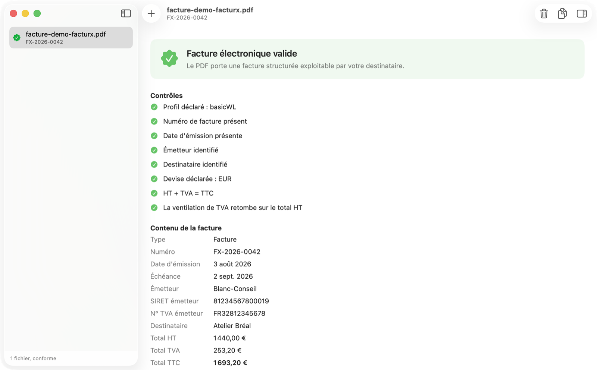
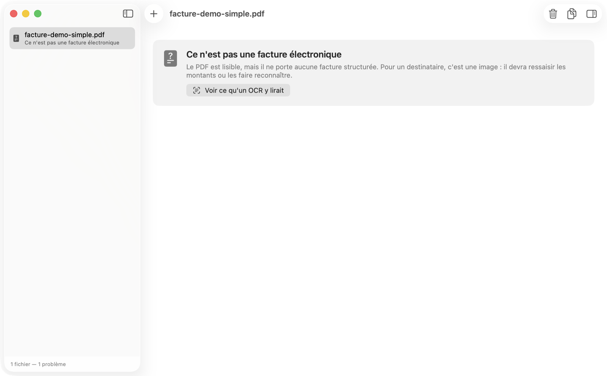
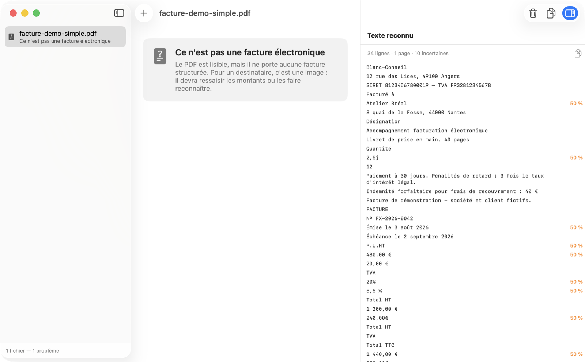
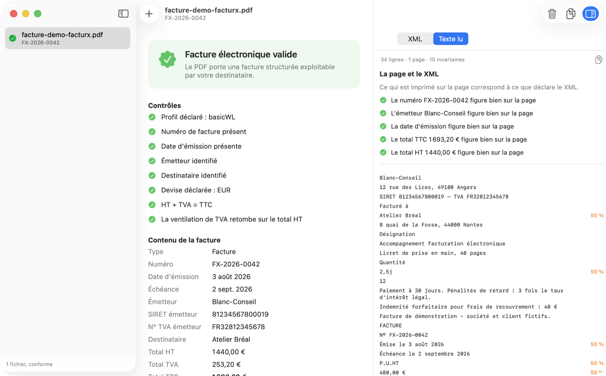

<div align="center">

# Factur-X Check

**Votre PDF est-il vraiment une facture électronique ?**
La réponse en le déposant — et rien ne quitte votre Mac.

[](#la-construire)
[](#la-construire)
[](#rien-ne-quitte-votre-machine)
[](Tests)
[](LICENSE)

### [⬇︎ Télécharger l'application](https://github.com/Romain04240/facturx-check/releases/latest)

Signée et notarisée par Apple — macOS 13 ou ultérieur.

</div>

---

À partir du **1ᵉʳ septembre 2026**, toute entreprise française assujettie à la
TVA doit savoir *recevoir* une facture électronique ; à partir du 1ᵉʳ septembre
2027, les TPE doivent savoir en *émettre*.

Un PDF qui ressemble à une facture n'en est pas une. Ce qui compte est
invisible à l'écran : un fichier XML embarqué dans le document. Cet outil
répond à la question qu'on se pose alors — **mon fichier est-il exploitable, ou
mon destinataire va-t-il devoir tout ressaisir ?**

## Les deux réponses possibles

Ces deux fichiers affichent **la même facture**, au pixel près. L'un est
exploitable par le logiciel de votre client, l'autre non — et rien à l'écran ne
permet de les distinguer. C'est tout l'objet de l'outil.

| Une facture électronique valide | Un PDF qui n'en est pas une |
|---|---|
|  |  |
| Le XML est là : profil, mentions obligatoires, totaux, ventilation de TVA — tout est lu et contrôlé. | Pour un destinataire, c'est une image. Il devra ressaisir les montants, ou les faire reconnaître. |

Les deux sont dans [`Samples/`](Samples) : déposez-les pour voir.

## Ce qui se passe quand le XML manque

Sans facture structurée, votre destinataire n'a plus que l'image. L'outil le
montre plutôt que de l'affirmer : il lit la page comme le ferait n'importe quel
logiciel de reconnaissance, et **signale en orange ce dont il n'est pas sûr**.



Regardez ce qui est marqué à 50 % : les montants, les taux, les dates. C'est
exactement ce qu'un destinataire devra ressaisir — ou risquer de comptabiliser
de travers. Un « 240,00€ » collé, un « 20% » sans espace, une ligne coupée au
mauvais endroit : voilà ce que vaut une facture qui n'est qu'une image.

## La page dit-elle la même chose que le XML ?

Sur une facture valide, le même volet sert à autre chose : il **rapproche la
page du XML** — numéro, émetteur, date, totaux.



C'est la seule divergence que personne ne voit : **votre client lit la page,
son logiciel lit le XML.** Un modèle d'impression resté sur l'ancien taux, une
facture rééditée sans régénérer le XML, un générateur qui recalcule mal — et
l'écart n'apparaît qu'au paiement.

Rien n'y est jamais compté comme un échec. Un OCR se trompe ; ce qui est dit
ici est toujours « je ne l'ai pas retrouvé », jamais « c'est faux ».

## Rien ne quitte votre machine

Une facture porte votre nom, celui de votre client et vos montants. Les
validateurs existants sont des services en ligne où l'on téléverse ce document
chez un tiers.

Ici, tout est analysé localement. L'application ne demande **aucune
autorisation réseau** — ce qui se vérifie en inspectant ses droits, plutôt
qu'en me croyant sur parole :

```bash
codesign -d --entitlements - "/Applications/Factur-X Check.app"
```

Un seul droit y figure : la lecture des fichiers que vous désignez vous-même.
C'est aussi pourquoi les boutons *copient* au lieu d'enregistrer — une fonction
d'enregistrement demanderait un droit d'écriture, et affaiblirait l'argument.

## Ce qu'il vérifie

| Contrôle | Ce qu'il attrape |
|---|---|
| Présence du XML embarqué | Un PDF « imprimé » qui n'a que l'apparence d'une facture |
| Profil Factur-X déclaré | Un destinataire strict peut refuser un profil absent |
| Numéro, date, émetteur | Mentions obligatoires manquantes |
| Devise déclarée | Des montants dont on ignore dans quelle monnaie ils sont |
| **HT + TVA = TTC** | L'erreur de génération la plus fréquente, et le rejet quasi certain |
| **Somme des bases = total HT** | Une ventilation qui contredit le pied de facture |
| **La page contre le XML** | Une facture dont l'imprimé et les données ne disent pas la même chose |

Un contrôle qui échoue dit **ce qu'il coûte**, pas seulement qu'il échoue :

> ✗ HT + TVA donne 1 440,00 €, le TTC déclaré est 1 490,00 €
> *Écart de 50,00 €. La plupart des destinataires rejettent sur ce seul point.*

Ces contrôles vivent dans `FacturXKit`, la bibliothèque que l'application et la
commande partagent : les deux ne peuvent pas répondre différemment sur le même
fichier.

## L'application

Elle montre, pour chaque fichier, le verdict, les contrôles un par un, le
contenu lu dans le XML et la ventilation de TVA. Un bouton copie le rapport en
texte : quand un contrôle échoue, la suite consiste presque toujours à écrire à
celui qui a émis la facture.

- **Un volet latéral affiche le XML embarqué**, ré-indenté et sélectionnable.
  Il reste ouvert d'un fichier à l'autre : on lit la source *en même temps* que
  le contrôle qui échoue.
- **Le rapprochement de la page et du XML** (voir plus haut).
- **Un dossier entier** se dépose aussi bien qu'un fichier. Et « Ouvrir avec »
  fonctionne depuis le Finder.

## La commande

```bash
git clone https://github.com/Romain04240/facturx-check
cd facturx-check
swift build -c release
cp .build/release/facturx-check /usr/local/bin/
```

macOS 13 ou ultérieur. Aucune dépendance : Foundation et Core Graphics.

```bash
facturx-check facture.pdf
facturx-check *.pdf                 # un lot entier
facturx-check facture.pdf --xml     # affiche aussi le XML embarqué
```

<details>
<summary>Ce que ça donne</summary>

```
▸ facture-demo-facturx.pdf
  ✓ XML Factur-X trouvé (2981 octets)

  Contenu
  Type                  Facture (380)
  Numéro                FX-2026-0042
  Date d'émission       2026-08-03
  Émetteur              Blanc-Conseil
  Total HT              1 440,00 €
  Total TVA             253,20 €
  Total TTC             1 693,20 €

  Ventilation de TVA
  20 %                  base 1 200,00 € — taxe 240,00 €
  5,5 %                 base 240,00 € — taxe 13,20 €

  Contrôles
  ✓ Profil déclaré : basicWL
  ✓ Numéro de facture présent
  ✓ Devise déclarée : EUR
  ✓ HT + TVA = TTC
  ✓ La ventilation de TVA retombe sur le total HT
```

</details>

Le code de sortie vaut **0** si tous les fichiers sont exploitables, **1**
sinon — de quoi l'employer dans un script ou une intégration continue :

```bash
facturx-check factures/*.pdf || echo "des factures ne passeront pas"
```

## La construire

Le projet Xcode est engendré à partir de `project.yml`, et n'est donc pas
versionné :

```bash
brew install xcodegen && xcodegen generate
open FacturXCheck.xcodeproj
```

```bash
swift build && swift test              # bibliothèque + commande
swift Scripts/make-samples.swift       # les factures de démonstration
```

## Ce qu'il ne fait pas

Ce n'est **pas** un validateur de schéma complet. Il ne vérifie ni le XSD, ni
les règles sémantiques EN 16931, ni la conformité PDF/A-3. Pour une validation
normative avant mise en production, passez par un validateur officiel.

Il répond à ce qui échoue en pratique, tout de suite et sans réseau.

## Origine

Le cœur de lecture vient d'Invoicio, application de facturation pour Mac,
iPhone, iPad et Apple Watch, où il sert à lire les factures fournisseurs reçues
au format Factur-X. Il est extrait ici parce que la question « mon PDF est-il
conforme ? » se pose bien au-delà de ses utilisateurs.

Écrit par Daniel-Romain Blanc — [Blanc-Conseil](mailto:daniel@blanc-conseil.fr).
Un contrôle vous manque, une facture est refusée sans que vous compreniez
pourquoi ? Écrivez-moi : c'est ce qui décide de la suite.

## Licence

MIT — voir [LICENSE](LICENSE).
